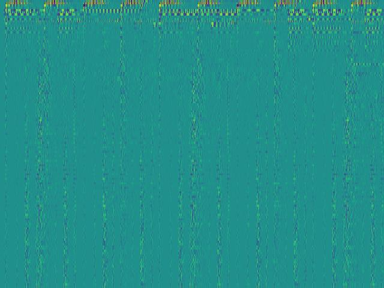
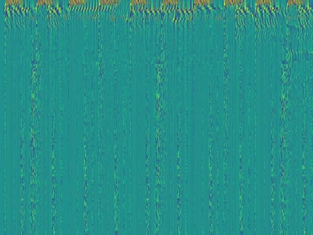
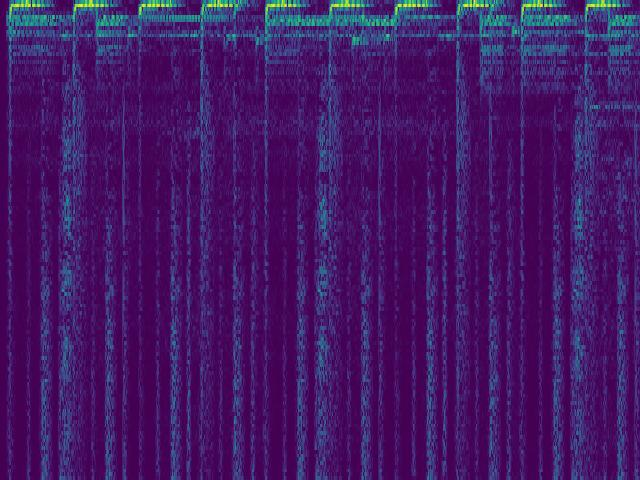
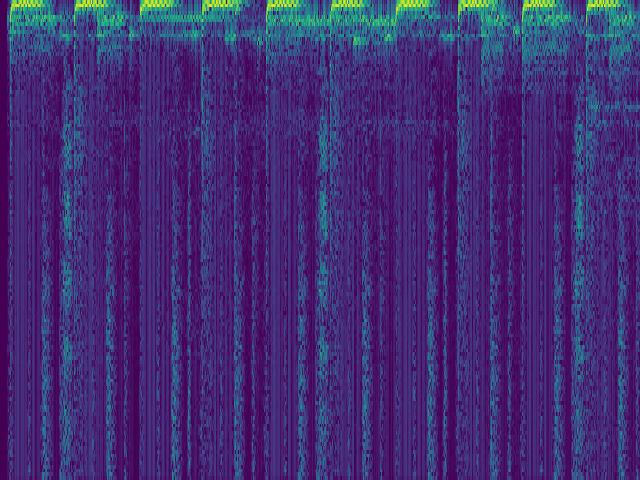

# iSincNet (Lightweight Sincnet Spectrogram Vocoder)

[[Blog]](https://github.com/wkzng/iSincNet) [[Original SincNet Paper (M. Ravenelli, Y. Bengio)]](https://arxiv.org/abs/1808.00158)

iSincNet is as Fast and Lightweight Sincnet Spectrogram Vocoder neural network trained to reconstruct audio waveforms from their SincNet spectogram (real and signed 2d representation). We used the GTZAN dataset which is the most-used public dataset for evaluation in machine listening research for music genre recognition (MGR). The files were collected in 2000-2001 from a variety of sources including personal CDs, radio, microphone recordings, in order to represent a variety of recording conditions (http://marsyas.info/downloads/datasets.html).

<p align="center">
  
</p>

Datasets used during development:
- [GTZAN](https://github.com/chittalpatel/Music-Genre-Classification-GTZAN)
- [MUSDB-18](https://sigsep.github.io/datasets/musdb.html)


## Example Spectrogram 
The First 5s second of the Audio `audio/invertibility/15033000.mp3`

|  | Non-causal Encoder | Causal Encoder |
|:------:|:-------------------:|:--------------:|
| signed values |  |  |
| abs values |  |  |


### 🎧 Pretrained Models
The following table summarizes the key characteristics and access points for the available pretrained models.
All models are open-source and stored in the `pretrained/` folder.

| Sample Rate | FPS | #Bins | Weights | Corpus | Causal Encoder | Scale | Open-Source |
|:------------:|:---:|:-----:|:--------|:--------|:----------------:|:-------:|:------------:|
| 16000 | 128 | 128 | [📦](pretrained/16000fs_128fps_128bins_lin_complex_ncausal.ckpt) | GTZAN | ✗ | Linear | √ |
| 16000 | 128 | 128 | [📦](pretrained/16000fs_128fps_128bins_lin_real_causal.ckpt) | GTZAN | √ | Linear | √ |
| 16000 | 128 | 128 | [📦](pretrained/16000fs_128fps_128bins_mel_complex_ncausal.ckpt) | GTZAN | ✗ | Mel | √ |
| 44100 | 350 | 128 | [📦](pretrained/44100fs_350fps_128bins_lin_complex_ncausal.ckpt) | GTZAN | ✗ | Linear | √ |
| 44100 | 350 | 128 | [📦](pretrained/44100fs_350fps_128bins_mel_complex_ncausal.ckpt) | GTZAN | ✗ | Mel | √ |


## Quick Start 
```bash
pip install -r requirements.txt
```
Please refer to the [demo notebook](demo.ipynb) which shows how to load and use the model


```python
import numpy as np
import librosa
import torch
from sincnet.model import SincNet, Quantizer
from datasets.utils.waveform import WaveformLoader 


SAMPLE_RATE = 16_000
device = torch.device("cuda" if torch.cuda.is_available() else "cpu")
audio_loader = WaveformLoader(sample_rate=SAMPLE_RATE) 

# load the model
params = {
    "fs": SAMPLE_RATE,
    "fps": 128,
    "scale": "lin",
    "component": "complex"
}

model : SincNet = (
    SincNet(**params)
    .load_pretrained_weights(weights_folder="pretrained", verbose=False)
    .eval()
    .to(device)
)

# encode and decode an audio waveform
duration = 5
offset = 0
audio_path = ... 
waveform = audio_loader.load_segment(audio_path, offset=0, duration=5, nchannels=1)
loudness = audio_loader.measure_loudness(waveform)
waveform = audio_loader.normalise_loudness(waveform, loudness, target_lufs=-23)

with torch.no_grad():
  audio_tensor = torch.from_numpy(waveform).to(device).float()
  spectrogram = model.encode(audio_tensor.unsqueeze(0), scale="mel")
  reconstructed_audio_tensor = model.decode(spectrogram, scale="mel")

#(optional) elementwise quantization into a discrete vocabulary of size 2^{q_bits}
quantizer = Quantizer(q_bits=10).to(device)
indices = quantizer(spectrogram)
dequantized_spectrogram = tokenizer.inverse(indices)
dequantized_audio = model.decode(dequantized_spectrogram)
```


## References Papers and Related Topics
- [1] Mirco Ravanelli, Yoshua Bengio, “Speaker Recognition from raw waveform with SincNet” [Arxiv](https://arxiv.org/abs/2109.08910)
- [2] MS-SincResNet: Joint Learning of 1D and 2D Kernels Using Multi-scale SincNet and ResNet for Music Genre Classification [Arxiv](https://arxiv.org/abs/2109.08910)
- [3] Curricular SincNet: Towards Robust Deep Speaker Recognition by Emphasizing Hard Samples in Latent Space
[Arxiv](https://arxiv.org/abs/2108.10714)
- [4] Interpretable SincNet-based Deep Learning for Emotion Recognition from EEG brain activity [Arxiv](https://arxiv.org/pdf/2107.10790)
- [5] Toward end-to-end interpretable convolutional neural networks for waveform signals [Arxiv](https://arxiv.org/pdf/2405.01815)
- [6] Filterband design for end-to-end speech separation [Arxiv](https://arxiv.org/pdf/1910.10400). This paper decomposes sinNet into a product sin * cos as implemented in this repo and bridgin the gap with Gabor filterbank

- [7] PF-Net: Personalized Filter for Speaker Recognition from Raw Waveform [Arxiv](https://arxiv.org/abs/2105.14826). This paper proposes to extend SincNet for more flexiblity by allowing alternative shapes to rectangle function in the spectral domain 

- [8] MelGAN: Generative Adversarial Networks for Conditional Waveform Synthesis [Arxiv](https://arxiv.org/pdf/1910.06711)
- [9] iSTFTNet: Fast and Lightweight Mel-Spectrogram Vocoder Incorporating Inverse Short-Time Fourier Transform [Arxiv](https://arxiv.org/abs/2203.02395)
- [10] iSTFTNet2: Faster and More Lightweight iSTFT-Based Neural Vocoder Using 1D-2D CNN [Arxiv](https://arxiv.org/pdf/2308.07117)
- [11] Deep Griffin-Lim Iteration [Arxiv](https://arxiv.org/abs/1903.03971)
- [12] Mel-Spectrogram Inversion via Alternating Direction Method of Multipliers [Arxiv](https://arxiv.org/pdf/2501.05557)
- [13] HiFi-GAN: Generative Adversarial Networks for Efficient and High Fidelity Speech Synthesis [Arxiv](https://arxiv.org/abs/2010.05646)

Related discussion about SincNet vs STFT https://github.com/mravanelli/SincNet/issues/74

## Usages and Implementations around SincNet
- https://github.com/mravanelli/SincNet
- https://github.com/mravanelli/pytorch-kaldi
- https://github.com/PeiChunChang/MS-SincResNet
- https://github.com/ZaUt-bio/Exploring-Filters-in-SincNet-Access-and-Visualization/blob/main/SincNet_filters_visualization_initials.ipynb


## Roadmap and projects status
- [x] Host weights in Github and add auto-download
- [ ] Benchmark of inversion vs Griffin-Lim, iSTFTNet

## Contributions and acknowledgment (TODO)
