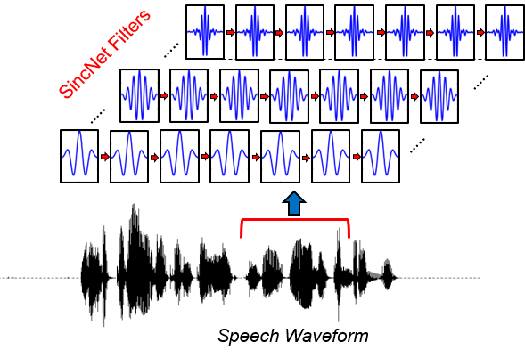
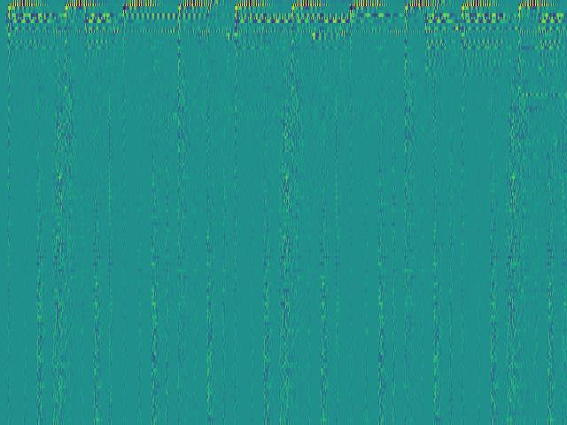
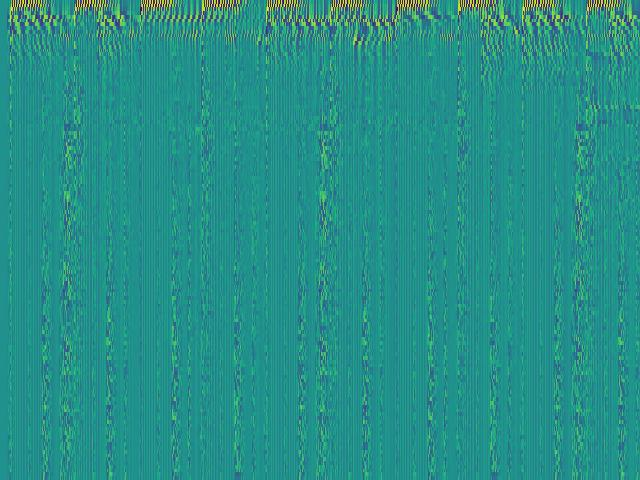
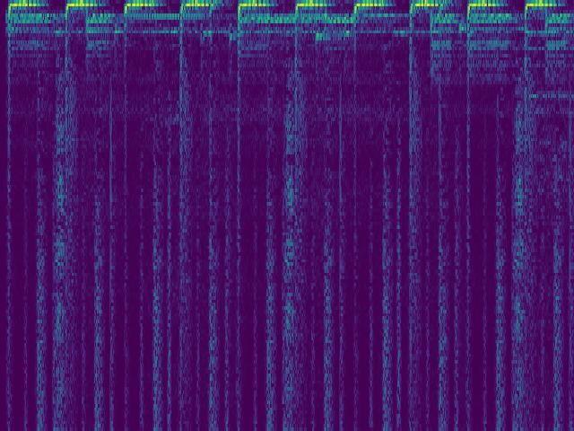
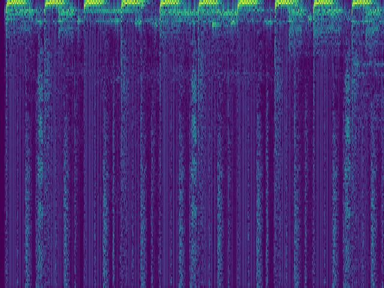

<div align="center">

<h1>iSincNet / Fast Invertible Audio Frontend</h1>

<em>A drop-in, differentiable spectrogram layer for PyTorch that decodes back to the waveform exactly, with no trained weights. Linear, interpretable, CPU-fast. Any scale: linear, mel, Bark, ERB.</em>
<br/><br/>

[](https://github.com/wkzng/iSincNet/actions/workflows/ci.yml)
[](https://www.python.org/)
[](LICENSE)
</div>

---

**iSincNet** turns a waveform into an interpretable 2-D spectrogram (a deterministic SincNet
filterbank) and back into the waveform. The decoder is a closed-form inverse of the encoder: no
vocoder, no training, no checkpoints. Pick any frequency scale (linear, mel, Bark, ERB);
reconstruction is length-exact and, for a well-conditioned bank, near-exact (about 100+ dB, up to
roughly 125 dB).

<p align="center">
  
</p>

## Example spectrogram

First 5 s of `audio/invertibility/15033000.mp3`. SincNet produces a signed, real-valued
representation; the causal encoder keeps the filters one-sided in time.

|  | Non-causal encoder | Causal encoder |
|:------:|:-------------------:|:--------------:|
| signed values |  |  |
| abs values |  |  |

## Quick start

```bash
pip install -r requirements.txt
```

```python
import torch
from sincnet.model import SincNet

# nothing to download: the decoder is the analytical inverse of the encoder
model = SincNet(fs=16_000, fps=128, n_bins=256, scale="mel",
                component="complex", causal=False, decoder_type="exact").eval()

wav = torch.randn(1, 16_000)                              # (B, T)
with torch.no_grad():
    spec  = model.encode(wav)                            # (B, 2, F, T) signed real/imag spectrogram
    recon = model.decode(spec, length=wav.shape[-1])    # (B, T) exact, training-free, length-preserving

    # optional mu-law quantization for a compact representation:
    q, scale = model.mulaw.quantize(spec)
    recon = model.decode(model.mulaw.dequantize(q, scale), length=wav.shape[-1])
```

See the [demo notebook](demo_sincnet.ipynb).

## Decoders

All share the same `encode` / `decode` API, are length-exact, and need no weights (pick via `decoder_type`):

| `decoder_type` | reconstruction | weights | differentiable |
|:--|:--|:--:|:--:|
| `"fast"` (default) | about 37 dB, single-pass `conv_transpose` + equalizer | none | yes |
| `"exact"` | about 100+ dB, conjugate-gradient pseudo-inverse (implicit backward) | none | yes |
| `"learnt"` | small trained overlap-add conv | 96k | yes |

`"exact"` is differentiable with O(1) memory in its iterations, so it drops straight into an
end-to-end objective such as a source separator. `"learnt"` is legacy; see [docs/pretrained.md](docs/pretrained.md).

## Frequency scales

`scale = "lin" | "mel" | "bark" | "erb"`: same machinery, different warping. The analytical decoder
inverts any of them. Warped scales become exactly invertible once the bank is complete (see below).
The filterbank and the optional sinc envelope are illustrated in [docs/filters.md](docs/filters.md).

## Invertibility

Whether `decode(encode(x))` is exact is fixed, before any training, by `n_bins`, `fps`, and the
kernel length. The bank is per-frame invertible (a clean closed-form inverse exists) once:

```
2 * n_bins >= kernel_size = coverage * fs / fps        <=>        n_bins * fps >= (coverage / 2) * fs
```

At `fps = 128` that means `n_bins >= 256`. `SincNet` warns at construction when a config sits below
the line. Comparing `STFT(x)` with `STFT(decode(encode(x)))`:

**128 bins (below the line): visible residual.**


**512 bins (well above the line): indistinguishable.**


Full derivation and more figures: [docs/invertibility_constraint.md](docs/invertibility_constraint.md).

## References
- [1] Ravanelli & Bengio, *Speaker Recognition from raw waveform with SincNet* [arXiv](https://arxiv.org/abs/2109.08910)
- [2] *Filterbank design for end-to-end speech separation* [arXiv](https://arxiv.org/pdf/1910.10400), which decomposes SincNet into a `cos * sin` product (the formulation used here)
- [3] *Toward end-to-end interpretable convolutional neural networks for waveform signals* [arXiv](https://arxiv.org/pdf/2405.01815)
- [4] *PF-Net: Personalized Filter for Speaker Recognition from Raw Waveform* [arXiv](https://arxiv.org/abs/2105.14826)

Related discussion, SincNet vs STFT: https://github.com/mravanelli/SincNet/issues/74

## SincNet in the wild
- https://github.com/mravanelli/SincNet
- https://github.com/mravanelli/pytorch-kaldi
- https://github.com/PeiChunChang/MS-SincResNet
