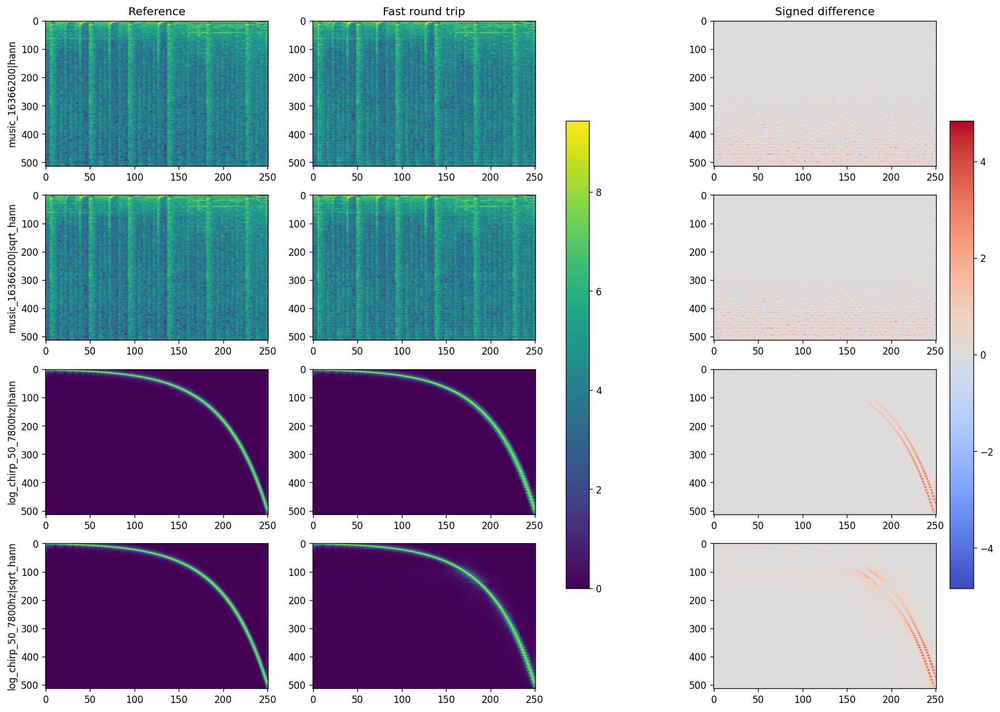

# Effect of the locality window

The sinc envelope experiment established that fixing the analysis filterbank can remove work that
had previously been delegated to a learned decoder. In the representative comparison,
`sinc envelope on + fast decoder` reached **18.94 dB**, while the legacy
`sinc envelope off + learned decoder` reached **16.93 dB**. This made a fully training-free path
credible, but left an obvious question: was the hard-coded Hann locality window quietly limiting
the fast decoder?

We tested that hypothesis without training, checkpoints, quantization, or parameter fitting. The
answer is reassuring: **Hann is a reasonable general-purpose window for the present geometry.** A
square-root Hann offers a small SNR gain, sometimes a large one, but its spectral residual is less
consistent. More aggressive tapers reduce the stripe metric only by sacrificing too much waveform
or spectral fidelity.

## What the locality window controls

The analysis kernel for bin `k` is

```text
psi_k(t) = exp(i 2 pi f_k t) sinc(B_k t) w(t),
```

where `w(t)` is the finite locality window. The encoder and matched synthesis both contain this
window, so the overlap contribution to the round trip is proportional to shifted copies of
`w²`.

For the tested configuration, `hop_length = 125` and `kernel_size = 501 = 4H + 1`. This geometry
gives both Hann and square-root Hann exactly constant overlap-square energy:

| Locality window `w` | Effective product | Overlap-square ripple |
|:--------------------|:------------------|----------------------:|
| `sqrt(Hann)` | Hann | 0 dB |
| Hann | Hann² | 0 dB |
| Hann² | Hann⁴ | 0.248 dB |

Thus Hann was not an arbitrary taper fighting overlap-add; at four-times overlap it already has an
exact constant-energy property. Hann² suppresses the endpoints more strongly, but introduces a
hop-phase gain variation. A phase-normalized Hann² was included to separate its shape from that
overlap defect.

## Methodology

### Primary screen

The fixed primary configuration was:

- 16 kHz sample rate, 128 fps, 128 complex non-causal mel bins;
- sinc envelope enabled;
- fast analytical decoder with `eq_eps = 1e-2`;
- float32 throughout.

Eighteen candidate windows were evaluated:

- Hann and square-root Hann;
- raw and phase-normalized Hann²;
- Gaussian windows with 20, 40, 60, and 80 dB endpoint attenuation, raw and phase-normalized;
- Kaiser windows with beta 4, 8, and 12, raw and phase-normalized.

The evaluation corpus contained eight loudness-normalized four-second clips: speech, two drum
stems, a pad stem, and four music excerpts. Synthetic controls added eight seeded noise signals, a
50 Hz–7.8 kHz logarithmic chirp, tones at every mel center and midpoint, and impulses covering all
125 hop phases.

For every candidate we recorded:

- full and boundary-cropped waveform SNR;
- gain-aligned SNR and RMS gain;
- band-normalized multi-resolution STFT loss;
- a stripe score measuring the high-frequency ripple of persistent per-frequency transfer error;
- window bandwidth/sidelobes, overlap-square ripple, filterbank power coverage, and polyphase frame
  bounds.

The decision rule was fixed before inspecting results. A candidate was eligible only if its median
SNR stayed within 0.25 dB of Hann, no clip lost more than 1 dB, and median MR-STFT stayed within 2%
of Hann. An eligible replacement then needed at least a 10% stripe-score improvement. This prevents
choosing a visually smoother error by quietly discarding waveform information.

### Generalization check

Hann and the eligible square-root Hann finalist were then compared on linear, mel, Bark, and ERB
scales at both 128 and 256 bins. The same window had to work across configurations; no per-scale
tuning was allowed.

## Primary results

Median results over the eight real clips were:

| Window | SNR | Delta vs Hann | MR-STFT | Stripe RMS | Eligible |
|:-------|----:|--------------:|--------:|-----------:|:--------:|
| **Hann** | 26.058 dB | — | 0.2404 | **0.7955 dB** | yes |
| `sqrt(Hann)` | **26.393 dB** | **+0.335 dB** | **0.2339** | 0.8265 dB | yes |
| Hann² | 24.188 dB | −1.870 dB | 0.3041 | 0.7544 dB | no |
| phase-normalized Hann² | 25.275 dB | −0.783 dB | 0.2716 | 0.7549 dB | no |
| phase-normalized Gaussian, 80 dB | 25.075 dB | −0.984 dB | 0.2858 | **0.7149 dB** | no |

The aggressive Gaussian is an instructive failure: it improved stripe RMS by 10.1%, but missed both
the SNR and MR-STFT safeguards. Hann² showed the same weaker pattern. Stronger tapering can make the
error look smoother while increasing its total cost.

Square-root Hann was the only alternative to pass all eligibility checks. It gained 0.335 dB SNR
and reduced MR-STFT by 2.7%, but made the primary stripe score 3.9% worse. Because it did not meet the
preregistered 10% stripe improvement, the protocol retained Hann as the general default.

## What the chirp reveals

The lower two rows show the same logarithmic chirp through Hann and square-root Hann. All magnitude
plots share one scale, and all signed errors share one symmetric scale.



Hann keeps the reconstruction error comparatively tight around the target trajectory.
Square-root Hann gains about 0.25 dB chirp SNR, but produces visibly broader oscillatory sidelobes;
its chirp MR-STFT rises from **1.844** to **3.509**, and stripe RMS rises from **2.693** to **3.102
dB**. The chirp therefore explains why a modest waveform-SNR improvement is not automatically a
cleaner spectral reconstruction.

## Cross-scale result

Square-root Hann increased median waveform SNR in all eight validation configurations, by 0.12 to
2.02 dB. The largest gain occurred for linear/128 bins. Its spectral behavior was not universal:

| Scale / bins | SNR delta | MR-STFT change | Stripe change |
|:-------------|----------:|---------------:|--------------:|
| linear / 128 | +2.015 dB | −27.5% | −68.0% |
| linear / 256 | +0.125 dB | **+26.8%** | **+74.5%** |
| mel / 128 | +0.335 dB | −2.7% | **+3.9%** |
| mel / 256 | +0.382 dB | −3.4% | −56.1% |
| Bark / 128 | +0.229 dB | −1.2% | −5.0% |
| Bark / 256 | +0.292 dB | −2.3% | **+0.7%** |
| ERB / 128 | +0.385 dB | −2.6% | −2.1% |
| ERB / 256 | +0.714 dB | −8.3% | −43.4% |

Negative percentages are improvements. The linear/256 regression is the clearest warning against
replacing Hann globally based on SNR alone.

## Conclusions

1. **Hann is not the hidden reconstruction defect.** At the current four-times-overlap geometry it
   has exact overlap-square energy and gives the most dependable spectral behavior.
2. **Square-root Hann is a legitimate optional SNR trade-off.** It consistently raised SNR, but did
   not consistently reduce stripes or MR-STFT error.
3. **More aggressive tapering is not free.** Gaussian, Kaiser, and Hann² variants could smooth the
   stripe metric, yet generally paid for it in SNR or MR-STFT fidelity.
4. **The sinc envelope remains the important analysis-side correction.** It lets the training-free
   fast decoder outperform the legacy envelope-off learned decoder in the representative ablation.
5. **The remaining SNR headroom is mainly in the decoder approximation.** For the well-conditioned
   mel/256 control, exact inversion reached about **121.5 dB**, while the fast decoder reached about
   **35.8 dB on the same two probes**. Window selection cannot close that gap; a better
   polyphase/canonical-dual fast synthesis is the more promising next target.

The complete code, notebook, tests, and result bundle are archived locally under
`.work/window_analysis/`.
