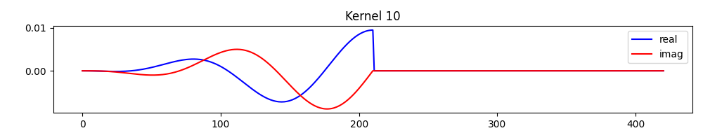
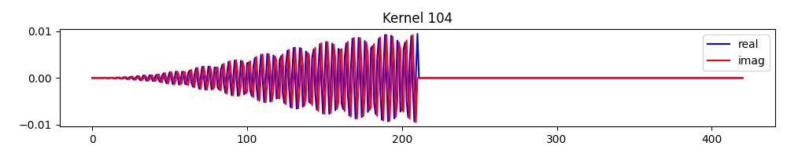
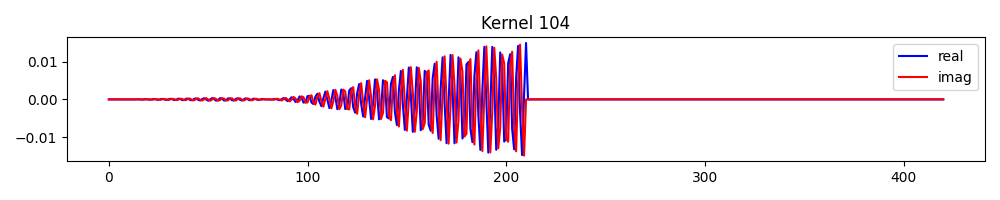

# SincNet filterbank: kernels and the sinc envelope

The encoder is a bank of complex sinc kernels (a `cos` and a `sin` filter per bin); the spectrogram
is the signed, real-valued response. Filters are deterministic, computed from the config, not learned.
Example spectrograms (causal vs non-causal) are shown in the README.

## Effect of the sinc envelope

As discussed in [Section 2.1 of the filterbank-design paper](https://arxiv.org/pdf/1910.10400),
SincNet can be recast as a wavelet transform with an envelope set by the sinc and the bandwidth:
`envelope(x, B) = sinc(B x / 2)`. Enable it with `apply_sinc_envelope=True`; the cos/sin components
are then modulated (causal filters shown):

| Kernel | index = 10 | index = 104 |
|:------:|:-------------------:|:--------------:|
| without sinc envelope |  |  |
| with sinc envelope |  |  |

At low frequencies the envelope's effect is negligible; at high frequencies it localises the filter.
