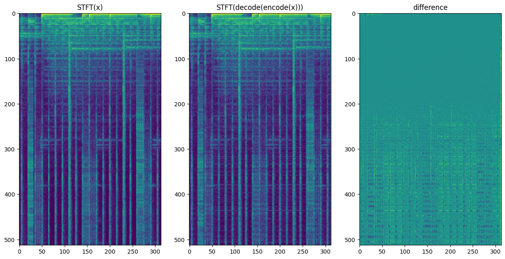
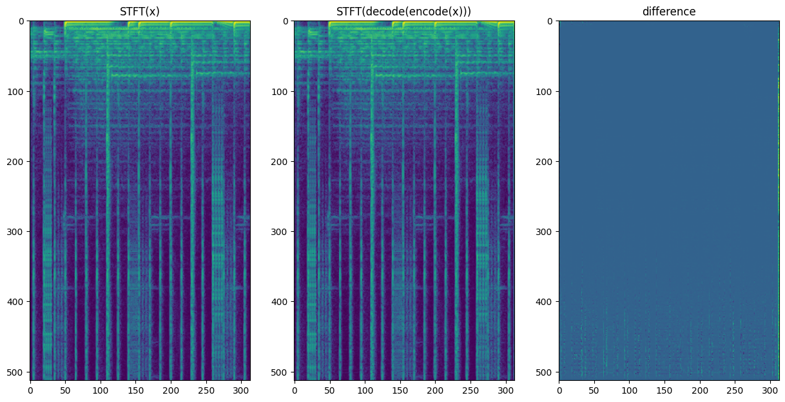
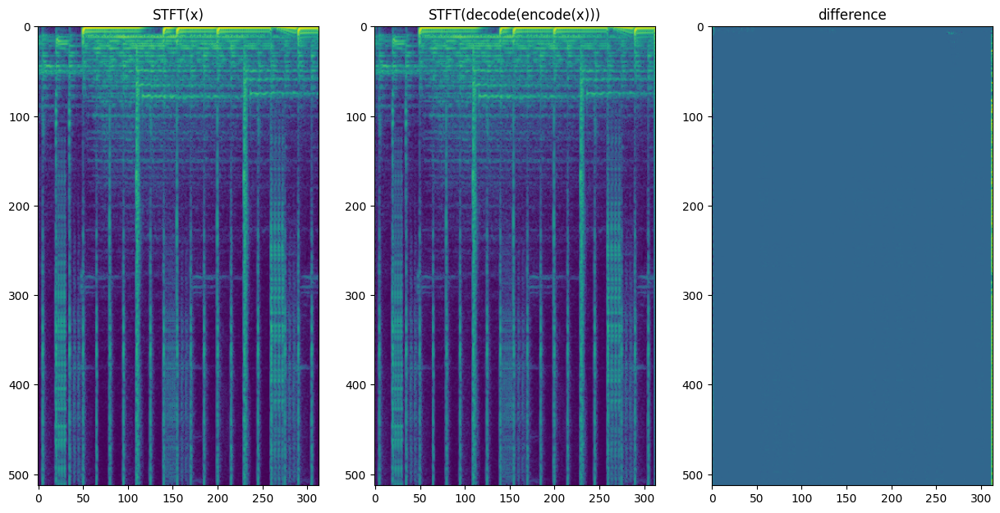

# The invertibility constraint

`SincNet` is a **decimated complex filterbank**: `encode` slides `N` complex sinc filters over the
waveform with a stride, and `decode` is trained to undo it. Whether that round-trip *can* be exact
is not a training question — it is fixed by three numbers: the number of filters `N`, the frame
rate `FPS`, and the kernel length `L`. This note expands the comment in
[`ModelArgs`](../sincnet/model.py) into the underlying linear algebra and shows the empirical
picture.

## 1. Analysis as a linear map

Write `H = hop_length = fs / FPS` (samples between frames) and `L = kernel_size` (filter length).
The repo couples them as `L = coverage · H + 1` with `coverage = 4`.

Per frame, the analysis takes the length-`L` window `x ∈ ℝ^L` and returns the response of each of
the `N` filters. Each filter is **complex** — a cosine part and a sine part — so it emits **two**
real numbers per bin. Stacking the `cos`/`sin` kernels into a matrix `K`, one frame is

```
s = K x ,        K ∈ ℝ^{2N × L} ,     x ∈ ℝ^L ,   s ∈ ℝ^{2N}
```

and the full transform applies this at stride `H` over overlapping windows.

> **Where the "2" comes from.** It is quadrature: a complex bin carries two reals (real+imag, i.e.
> `cos`+`sin`). `N` complex bins ⇒ `2N` real coefficients per frame. With `component="real"` only
> the cosine part is kept and the factor drops to `1` (`factor = 2 if complex else 1`).

## 2. Two thresholds, not one

### Global invertibility — `2N ≥ H`

The transform advances `H` new samples per frame and emits `2N` real numbers per frame, so its
**redundancy** is `ρ = 2N / H`. Information is preserved as long as `ρ ≥ 1`, i.e.

```
2N ≥ H            (redundancy ≥ 1)
```

At `fps = 128` (`H = 125`) even `N = 128` gives `ρ ≈ 2` — the analysis discards nothing. We verified
this directly: the exact (global) least-squares inverse reconstructs a 128-bin signal to ~machine
precision, and still to ~53 dB after 8-bit quantization. **So 128 bins is already invertible.**

### Per-frame invertibility — `2N ≥ L`

Recovering a single window `x` from *its own* coefficients `s = K x` needs `K` to be injective, i.e.
full column rank `L`. A `2N × L` matrix can only have rank `L` when

```
2N ≥ L = coverage · H            (here 2N ≥ 501)
```

and then the inverse is explicit via the normal equations:

```
KᵀK x = Kᵀ s     ⇒     x = (KᵀK)⁻¹ Kᵀ s         (KᵀK is L×L, invertible iff rank K = L)
```

Because `L = coverage · H = 4H`, this is **4× stricter** than the global condition. Below it `KᵀK`
is singular: each frame is *under-determined by its own coefficients*, and any exact reconstruction
must borrow from the overlapping neighbours.

This per-frame line is also exactly where one scale becomes a **closed-form projection** of another:
when `2N ≥ L`, the `2N` real kernels span `ℝ^L`, so *any* filterbank (mel, bark, erb …) is an exact
fixed linear combination of the linear one — `mel = Q · lin` with `Q = A_mel · A_lin⁺`, no learning
(machine-exact at `256 → 128`; impossible below the line).

## 3. Design rule

Substituting `H = fs / FPS` into `2N ≥ coverage · H`:

```
N · FPS  ≥  (coverage / 2) · fs          ⇔   per-frame invertible
```

With `coverage = 4` that is `N · FPS ≥ 2·fs`. It is a **two-knob** condition — you can pay it in bins
*or* in frame rate (a higher `FPS` shortens the kernel and lowers the bin requirement):

| `FPS` | `H` | `L = 4H+1` | min `N` (per-frame, ↑ to power of 2) | min `N` (global) |
|:----:|:---:|:----:|:----:|:----:|
| 64  | 250 | 1001 | 512 | 128 |
| 128 | 125 | 501  | **256** | 64 |
| 256 |  62 | 249  | 128 | 32 |

`n_bins` is required to be a power of two, so at `fps = 128` the first qualifying value is **256**.
The constructor emits a warning when a config sits below the per-frame line.

## 4. The picture

Reconstruction of the same clip — `STFT(x)`, `STFT(decode(encode(x)))`, and their difference — for
trained `fps = 128` models as `N` crosses the per-frame line (`N ≥ 251 ⇒ 256`):

**128 bins — below the line** (`2N = 256 < 501`): visible residual in the difference panel.


**256 bins — just above** (`2N = 512 ≥ 501`): the difference is already marginal.


**512 bins — well above** (`2N = 1024 ≫ 501`): `decode(encode(x))` is indistinguishable from `x`.


## 5. In principle vs. in practice

A subtlety worth stating plainly: **all three settings are globally invertible** — the exact
inverse recovers even the 128-bin case to machine precision (§2). What the figures track is the
*trained, local* decoder, which reconstructs cleanly once `N` crosses the **per-frame** line, where
each frame is invertible on its own and the decoder no longer has to stitch a window together from
many overlapping neighbours.

So the practical takeaway is: to get a clean round-trip from a *simple* decoder (or to read another
scale off the linear bank for free), keep `N · FPS ≥ (coverage/2)·fs`. The exact reason a *learned*
decoder gains so much from crossing this line — given the analysis is already information-complete
well before it — is not fully closed; scratch experiments live under `.work/`.
