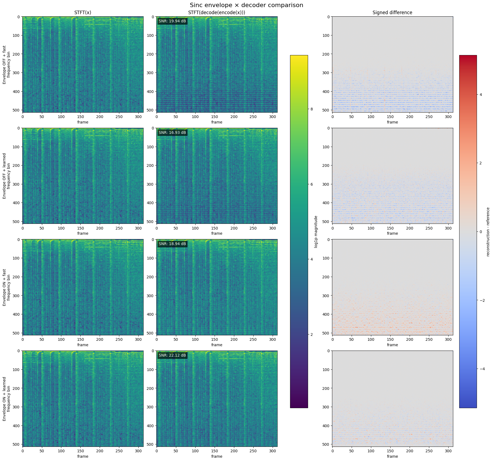

# Why the sinc envelope matters

`SincNet` builds each complex analysis filter from a carrier frequency, a locality window, and,
optionally, a sinc envelope. The envelope is enabled with:

```python
model = SincNet(
    ...,
    apply_sinc_envelope=True,
)
```

Despite looking like a small implementation option, the envelope changes the filterbank's
frequency coverage. This is especially important for warped scales such as mel, Bark, and ERB.

## The kernel with and without the envelope

For bin `k`, let:

- `f_k` be its center frequency in Hz;
- `B_k` be the width of its interval on the chosen frequency scale, converted back to Hz;
- `h(t)` be the finite Hann locality window.

Without the sinc envelope, the complex kernel is approximately

```text
psi_k(t) = exp(i 2 pi f_k t) h(t).
```

Its real and imaginary parts give the cosine and sine filters used by the encoder. Since every bin
uses the same Hann window, every filter has roughly the same bandwidth in Hz. Changing `f_k` moves
this fixed-width response along the frequency axis but does not adapt its width to the distance
between neighboring centers.

With the envelope enabled, the implementation uses

```text
e_k(t)   = sinc(B_k t)
psi_k(t) = exp(i 2 pi f_k t) e_k(t) h(t),
```

where `sinc(u) = sin(pi u) / (pi u)`. This is implemented in
[`compute_complex_kernel`](../sincnet/model.py).

### Time-domain interpretation

The zero crossings of `sinc(B_k t)` get closer as `B_k` increases. Wide high-frequency bands
therefore receive a more localized impulse response, while narrow low-frequency bands use a longer
effective response.

### Frequency-domain interpretation

A sinc in time corresponds to a rectangular region in frequency. Multiplying the carrier by
`sinc(B_k t)` therefore gives it a passband whose width is controlled by `B_k`; the Hann window
smooths and broadens its edges. The carrier shifts that passband from zero to `f_k`.

In short, the envelope turns a bank of fixed-width carriers into a bank whose bandwidths follow the
chosen frequency scale.

## Why the version without the envelope leaves stripes

Linear frequency centers have constant spacing in Hz, so fixed-width filters can sometimes cover
them reasonably well. Warped scales are different: mel, Bark, and ERB centers spread farther apart
in Hz toward the top of the spectrum.

With the envelope disabled:

1. the Hann window gives all carriers a similar frequency width;
2. high-frequency center spacing grows, but filter width does not;
3. gaps and deep dips appear in the summed filter power;
4. those frequency-dependent dips persist over time and appear as horizontal stripes in an STFT.

The relevant coverage function is

```text
G(f) = sum_k (|A_k(f)|^2 + |B_k(f)|^2),
```

where `A_k` and `B_k` are the Fourier responses of the cosine and sine filters. A flat `G(f)` is the
tight-frame ideal. Deep dips make inversion poorly conditioned: information in those regions is
weakly represented, and an inverse must apply very large gains to recover it.

The sinc envelope uses the already-computed `B_k` values to widen filters where the warped centers
are farther apart. This fills much of the missing coverage and makes the frame operator better
conditioned. It does not, by itself, make the bank a perfect tight frame.

## Measured decoder interaction

The following comparison uses the same 16 kHz waveform and the same 128-bin, 128-fps, complex,
non-causal mel encoder in every row. The first two columns share one log-STFT color scale. All signed
errors share one symmetric scale, so colors are directly comparable across the four variants.



| Sinc envelope | Decoder | Waveform SNR |
|:-------------:|:-------:|-------------:|
| off | fast | 19.94 dB |
| off | learned | 16.93 dB |
| on | fast | 18.94 dB |
| on | learned | **22.12 dB** |

There are two important conclusions.

First, the envelope changes the *structure* of the error more clearly than this single aggregate SNR
number. `off + fast` has slightly higher SNR than `on + fast` for this example, but its residual is a
strong frequency comb. SNR sums error energy over the whole waveform and does not distinguish a
quiet, perceptually conspicuous tonal error from a broader residual. The signed log-STFT exposes
that distinction.

Second, the envelope and decoder interact. In this experiment, the learned decoder performs worst
when asked to invert the poorly covered bank, but it produces the best result once the envelope
supplies meaningful coverage. A learned synthesis stage can then spend its capacity correcting remaining gain,
cross-frame, and alias terms instead of trying to reconstruct information from spectral gaps.

## Why the fast decoder is still imperfect

The fast decoder first applies the adjoint filterbank and then divides by an FFT-domain estimate of
`G(f)`. This corrects the main frequency-dependent gain, but it treats the strided frame operator as
if it were one ordinary convolution. With `hop_length > 1`, the true operator is polyphase and has
alias components. A scalar equalizer cannot cancel all of those components.

Consequently:

- the envelope improves the analysis bank's coverage;
- the fast equalizer corrects much of its diagonal frequency gain;
- residual hop-phase and alias errors remain;
- the learned decoder can model some of those residual interactions;
- the exact conjugate-gradient decoder remains the clean control for whether the analysis itself
  preserved the information.

Lowering the fast decoder's equalizer floor is not a substitute for good coverage: it can amplify
noise and aliasing around deep response nulls.

## Practical guidance

- Prefer `apply_sinc_envelope=True` for mel, Bark, and ERB banks.
- Treat envelope-on and envelope-off learned decoders as different models and checkpoints. Envelope
  checkpoints carry the `_sinc` suffix in their model ID.
- Compare variants using a shared spectrogram scale, a shared symmetric error scale, waveform SNR,
  and a spectral metric such as multi-resolution STFT loss.
- Use [`comparison.ipynb`](../comparison.ipynb) to reproduce the four-way ablation.
- Use `decoder_type="exact"` as a diagnostic when separating analysis-bank limitations from fast
  decoder approximation error.

For the full frame-operator and aliasing derivation, see [research.md](research.md).

For the subsequent training-free locality-window ablation, see
[Effect of the locality window](effect_of_window.md).
